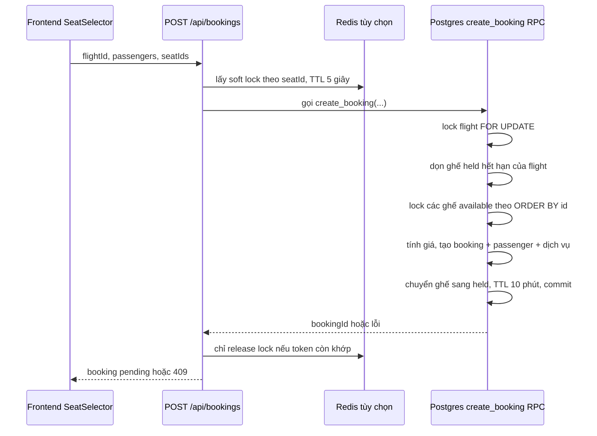
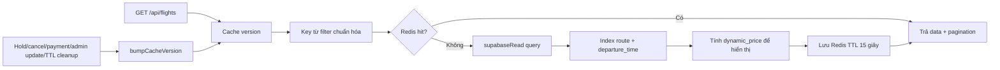

# Ba bài toán kinh điển trong hệ thống đặt vé

Tài liệu này mô tả **đúng theo code hiện tại** cách VietFly xử lý ba bài toán khó nhất của một hệ thống đặt vé:

1. Tồn kho ghế và cạnh tranh đồng thời (Seat Inventory & Concurrency).
2. Tìm kiếm chuyến bay, cache và giá động (Flight Search & Caching).
3. Thanh toán phân tán và Saga (Distributed Transaction & Saga).

Mục tiêu là giữ thiết kế đủ đơn giản để vận hành bằng Express + Supabase + Redis tùy chọn, nhưng đảm bảo các quyết định quan trọng luôn ở Postgres, không ở frontend hay Redis.

## 0. Phạm vi, migration và nguyên tắc nguồn sự thật

Các migration phải chạy theo thứ tự sau trước khi sử dụng các luồng trong tài liệu:

```bash
psql "$DATABASE_URL" -f backend/database/schema.sql
psql "$DATABASE_URL" -f backend/database/migrations/20260714120000_secure_booking_and_payment.sql
psql "$DATABASE_URL" -f backend/database/migrations/20260715230000_harden_inventory_search_and_saga.sql
```

Migration thứ hai tạo các RPC booking/cancel/release ban đầu. Migration thứ ba thêm `hold_expires_at`, index, dynamic pricing, job TTL và state `refund_pending`. Đường dẫn đúng trong repository là `backend/database/migrations/`, không phải `supabase/migrations/`.

| Thành phần | Có phải nguồn sự thật? | Vai trò |
| --- | --- | --- |
| Postgres/Supabase | Có | Ghế, số ghế còn lại, giá chốt, booking, payment và transition trạng thái. |
| Postgres RPC | Có | Gom nhiều câu lệnh vào một transaction; rollback toàn bộ nếu bất kỳ bước nào lỗi. |
| Redis | Không | Soft lock và cache. Redis mất kết nối không được phép tạo overbooking. |
| Backend Express | Không | Xác thực, validate request, điều phối RPC, cache, notification và xác minh webhook. |
| Frontend | Không | Hiển thị dữ liệu, gửi lựa chọn; không tự đổi trạng thái ghế/booking/payment. |

Các comment `Bài toán 1`, `Bài toán 2`, `Bài toán 3` ở code đánh dấu các hàm then chốt. README này bổ sung phần giải thích chi tiết cho cả những file chỉ làm nhiệm vụ route, validate hoặc hiển thị.

---

# 1. Quản lý tồn kho ghế và chống bán trùng

## Bài toán cần giải

Hai người có thể cùng thấy ghế `16A` đang `available` và cùng gửi request trong vài mili-giây. Cách làm sai là đọc trạng thái ghế bằng JavaScript, sau đó mới `UPDATE`: cả hai request có thể cùng đọc dữ liệu cũ trước khi request nào ghi xuống database.

Các bất biến mà hệ thống phải giữ:

- Một ghế chỉ thuộc tối đa một booking tại một thời điểm.
- `flights.available_seats` chỉ giảm khi ghế thực sự chuyển sang `held`/`booked`; không âm.
- Ghế giữ tạm phải tự trả lại sau 10 phút.
- Nếu một bước tạo booking lỗi, không được tồn tại booking, passenger, dịch vụ hoặc số ghế còn lại ở trạng thái nửa chừng.
- Nhiều backend instance có thể cùng xử lý mà không bán trùng.

## Luồng chuẩn đang dùng



`frontend/src/features/seats/SeatSelector.jsx` gửi một request tạo booking sau khi người dùng bấm tiếp tục. Đây là đường chính: `create_booking` giữ **toàn bộ** ghế đã chọn trong một transaction. API `/api/seats/hold` tồn tại cho luồng giữ một ghế riêng lẻ trên booking `pending`, nhưng vẫn phải qua RPC `hold_seat` ở database.

## Lớp 1: Redis soft lock chỉ để giảm tranh chấp

File `backend/src/config/cache.js` lấy lock theo danh sách ghế đã sort. `NX` bảo đảm chỉ request đầu tiên có thể tạo key; `PX` làm lock tự hết hạn nếu process chết.

```js
const token = randomUUID();
const lockKeys = [...new Set(keys)].sort().map((key) => `seat-lock:${key}`);

for (const key of lockKeys) {
  const acquired = await redis.set(key, token, { NX: true, PX: 5_000 });
  if (!acquired) {
    throw Object.assign(new Error('Seat selection is being processed. Please try again'), { status: 409 });
  }
  acquiredKeys.push(key);
}
```

Giải thích:

- `new Set(keys)` loại seat ID lặp trước khi lấy lock.
- `sort()` khiến mọi request lấy lock cùng thứ tự, giảm nguy cơ hai request giữ hai key ngược nhau.
- Lock chỉ sống 5 giây vì nó chỉ là lớp giảm tải; không dùng nó làm thời gian giữ ghế cho khách.
- Không có Redis hoặc Redis lỗi: `withRedisLocks` gọi thẳng `task()`. Tính đúng đắn vẫn do transaction Postgres bảo vệ.

Khi giải phóng lock, Lua script kiểm tra token thay vì gọi `DEL` mù quáng:

```js
await redis.eval(
  'if redis.call("get", KEYS[1]) == ARGV[1] then return redis.call("del", KEYS[1]) end return 0',
  { keys: [key], arguments: [token] },
);
```

Điều này tránh request A hết hạn lock rồi xóa nhầm lock mới mà request B đang nắm giữ.

## Lớp 2: Transaction + row lock ở Postgres là cơ chế quyết định

Hàm `create_booking` trong `backend/database/migrations/20260715230000_harden_inventory_search_and_saga.sql` là điểm chống overbooking thực sự. Các câu lệnh dưới đây nằm cùng một Postgres transaction do RPC thực hiện.

```sql
SELECT * INTO v_flight
FROM flights
WHERE id = p_flight_id
  AND departure_time > NOW()
  AND status IN ('scheduled', 'delayed')
FOR UPDATE;

FOR v_seat IN
  SELECT id, price
  FROM seats
  WHERE id = ANY(p_seat_ids)
    AND flight_id = p_flight_id
    AND status = 'available'
  ORDER BY id
  FOR UPDATE
LOOP
  v_seat_count := v_seat_count + 1;
  v_ticket_total := v_ticket_total + v_seat.price;
END LOOP;

IF v_seat_count <> cardinality(p_seat_ids) THEN
  RAISE EXCEPTION 'One or more seats are not available' USING ERRCODE = 'P0001';
END IF;
```

Giải thích từng phần:

1. `FOR UPDATE` trên flight tuần tự hóa thay đổi `available_seats` và việc chốt dynamic price của cùng một chuyến bay.
2. Query ghế chỉ lấy ghế `available`, lock theo `ORDER BY id` cố định. Request thứ hai phải chờ request đầu tiên commit/rollback.
3. Khi request thứ nhất commit, các ghế đã thành `held`; request thứ hai không còn lấy đủ số ghế nên `v_seat_count` thiếu và nhận lỗi `P0001`.
4. Backend chuyển `P0001` thành HTTP `409 Conflict` trong `booking.queries.js`, để frontend tải lại sơ đồ ghế thay vì coi đó là lỗi server.

Phần ghi dữ liệu cũng nằm trong RPC:

```sql
INSERT INTO bookings (..., status, hold_expires_at)
VALUES (..., 'pending', v_hold_expires_at)
RETURNING id INTO v_booking_id;

UPDATE seats
SET status = 'held', booking_id = v_booking_id,
    hold_expires_at = v_hold_expires_at
WHERE id = ANY(p_seat_ids);

UPDATE flights
SET available_seats = available_seats - cardinality(p_seat_ids)
WHERE id = p_flight_id;
```

Sau đó RPC mới insert passengers, `booking_seats`, baggage, meals, discount và cập nhật tổng tiền. Bất kỳ `RAISE EXCEPTION` hoặc lỗi SQL nào cũng rollback toàn bộ, nên không có ghế bị giữ mà thiếu booking hoặc ngược lại.

## TTL 10 phút và cleanup an toàn khi scale ngang

Ghế có state machine:

```text
available --create_booking/hold_seat--> held --payment success--> booked
                                      |
                                      +--TTL, cancel, payment failed--> available
```

TTL được lưu ở cả `seats.hold_expires_at` và `bookings.hold_expires_at`. Có hai tuyến dọn:

1. Ngay trong `create_booking`, các ghế `held` đã hết hạn của chính flight được dọn trước khi lock ghế mới.
2. `backend/src/jobs/seatHoldCleanup.job.js` gọi RPC `release_expired_held_seats` lúc khởi động và mỗi `SEAT_CLEANUP_INTERVAL_MS` (mặc định 60 giây).

RPC cleanup dùng `FOR UPDATE SKIP LOCKED`:

```sql
WITH expired AS (
  SELECT id, flight_id, booking_id
  FROM seats
  WHERE status = 'held'
    AND (hold_expires_at IS NULL OR hold_expires_at <= NOW())
  FOR UPDATE SKIP LOCKED
), released AS (
  UPDATE seats seat
  SET status = 'available', booking_id = NULL, hold_expires_at = NULL
  FROM expired
  WHERE seat.id = expired.id
  RETURNING expired.flight_id, expired.booking_id
)
```

`SKIP LOCKED` có nghĩa là instance B bỏ qua row instance A đang dọn thay vì chờ hoặc dọn lại. Sau đó cùng transaction cộng `flights.available_seats` theo số ghế đã release và chuyển booking `pending` liên quan sang `cancelled`.

## API, file liên quan và trách nhiệm

| File | Bài toán 1 xử lý gì? |
| --- | --- |
| `backend/database/schema.sql` | Định nghĩa `flights.available_seats`, `seats.status`, `seats.booking_id`, `bookings.status`, `payments.transaction_ref` unique. |
| `backend/database/migrations/20260714120000_secure_booking_and_payment.sql` | RPC nền tảng: `release_held_seat`, `cancel_booking` và quyền execute cho `service_role`. |
| `backend/database/migrations/20260715230000_harden_inventory_search_and_saga.sql` | Thêm `hold_expires_at`, index held expiry, `hold_seat`, `release_expired_held_seats`, `create_booking` có row lock. Đây là file quan trọng nhất. |
| `backend/src/config/cache.js` | Redis soft lock token-safe; Redis không khả dụng thì fallback transaction DB. |
| `backend/src/config/env.js` | Đọc `REDIS_URL`, `SEAT_CLEANUP_INTERVAL_MS`. |
| `backend/src/server.js` | Khởi chạy cleanup job sau khi Express listen. |
| `backend/src/jobs/seatHoldCleanup.job.js` | Gọi RPC dọn TTL, bump search-cache version nếu tồn kho đổi. |
| `backend/src/modules/bookings/booking.routes.js` | Public contract đã xác thực: `POST /api/bookings`, `PATCH /api/bookings/:bookingId/cancel`. |
| `backend/src/modules/bookings/booking.schema.js` | Kiểm tra passenger, seat ID, baggage/meal/discount trước khi vào service. |
| `backend/src/modules/bookings/booking.controller.js` | Truyền user ID đã authenticate và request đã validate vào service. |
| `backend/src/modules/bookings/booking.service.js` | Bọc create bằng `withRedisLocks`, gửi notification sau commit, invalid cache sau giữ/hủy ghế. |
| `backend/src/modules/bookings/booking.queries.js` | Gọi RPC `create_booking`/`cancel_booking`, đổi lỗi seat unavailable thành HTTP 409. |
| `backend/src/modules/seats/seat.routes.js` | `GET /api/seats`, `POST /api/seats/hold`, `PATCH /api/seats/:seatId/release`. |
| `backend/src/modules/seats/seat.schema.js` | Validate `flightId`, `bookingId`, `seatId`. |
| `backend/src/modules/seats/seat.controller.js` | Adapter HTTP cho seat service. |
| `backend/src/modules/seats/seat.service.js` | Kiểm tra booking thuộc user/seat đúng flight trước khi gọi RPC; invalid cache sau commit. |
| `backend/src/modules/seats/seat.queries.js` | Đọc sơ đồ ghế, gọi `hold_seat` và `release_held_seat`. |
| `backend/src/modules/payments/payment.service.js` | Webhook confirm/fail sẽ chuyển held sang booked hoặc trả ghế; đây là điểm giao với bài toán 3. |
| `frontend/src/features/seats/SeatSelector.jsx` | Poll sơ đồ ghế mỗi 15 giây; gửi `POST /api/bookings`; khi 409 thì tải lại ghế. |
| `frontend/src/components/booking/SeatMap.jsx` | Chỉ hiển thị state `available/held/booked`; không ghi trực tiếp DB. |

## Các tình huống cần kiểm thử

| Tình huống | Kết quả đúng |
| --- | --- |
| Hai request cùng `seatId` | Một request `201`, request còn lại `409`; không có double booking. |
| Redis tắt | Booking vẫn đúng nhờ `FOR UPDATE`; chỉ mất soft lock/cache. |
| Process chết sau khi giữ ghế | Redis lock tự hết sau 5 giây; ghế DB tự hết hạn sau 10 phút. |
| Nhiều backend instance chạy job | `SKIP LOCKED` khiến mỗi ghế chỉ được release một lần. |
| Khách hủy booking `pending` | RPC trả ghế và tăng `available_seats`; cache version đổi sau commit. |

---

# 2. Tìm kiếm chuyến bay, cache và giá động

## Bài toán cần giải

Search là endpoint public, có thể nhận nhiều request giống nhau. Nếu mọi request đều query join `flights`, airline, aircraft, hai airport và đếm chính xác toàn bộ kết quả, database sẽ bị đọc lặp. Đồng thời giá hiển thị cần thay đổi theo tải ghế, nhưng giá lúc thanh toán không được tin từ client hoặc cache cũ.

## Luồng đọc/ghi



## Read/write separation thực tế

`backend/src/config/supabase.js` tạo hai client:

```js
export const supabase = createClient(
  env.supabaseUrl,
  env.supabaseServiceRoleKey,
  clientOptions,
);

export const supabaseRead = env.supabaseReadUrl && env.supabaseReadServiceRoleKey
  ? createClient(env.supabaseReadUrl, env.supabaseReadServiceRoleKey, clientOptions)
  : supabase;
```

- `supabase`: luôn dùng cho write, RPC booking và payment.
- `supabaseRead`: chỉ dùng ở query đọc flight/seat. Nếu chưa có replica, nó fallback an toàn về `supabase`.
- Khi có read replica, chỉ cần điền `SUPABASE_READ_URL` và `SUPABASE_READ_SERVICE_ROLE_KEY`; API và service không đổi.

## Cache versioning: invalidation O(1), không quét Redis

`flight.service.js` không dùng cache key theo prefix để rồi quét/xóa hàng loạt. Nó lấy version hiện tại và đưa version vào key:

```js
const cacheVersion = await getCacheVersion('flight-search');
const cacheKey = buildSearchCacheKey({ ...filters, page, limit }, cacheVersion);
const cachedResult = await getCachedJson(cacheKey);

if (cachedResult) {
  return cachedResult;
}

const { data, count } = await flightQueries.search(filters, from, to);
const result = {
  data: data.map(addDynamicPrice),
  pagination: createPagination(page, limit, count),
};

await setCachedJson(cacheKey, result, env.flightSearchCacheTtlSeconds);
```

Khi tồn kho thay đổi, code chỉ tăng một counter:

```js
export const bumpCacheVersion = async (scope) => {
  const redis = await getClient();
  if (!redis) return;
  await redis.incr(`cache-version:${scope}`);
};
```

Key của request sau sẽ khác, ví dụ `flight-search:12:...` thành `flight-search:13:...`. Cache cũ không cần xóa ngay; nó tự hết hạn sau TTL. Vì vậy invalidation là O(1), tránh `SCAN` gây tải Redis ở lúc nhiều key.

Các nơi gọi `bumpCacheVersion('flight-search')`:

- `booking.service.js`: booking được tạo hoặc hủy.
- `seat.service.js`: giữ/trả từng ghế.
- `payment.service.js`: webhook có thể confirm hoặc release ghế.
- `seatHoldCleanup.job.js`: job trả ghế hết hạn.
- `flight.service.js`: admin tạo/sửa chuyến bay.

Nếu Redis không cấu hình hoặc lỗi, `getCachedJson` trả `null`, `setCachedJson`/`bumpCacheVersion` không ném lỗi. Search chậm hơn nhưng vẫn đúng vì query quay về Postgres.

## Query index-friendly và pagination

Migration tạo index partial đúng các filter thông dụng:

```sql
CREATE INDEX idx_flights_search_route_departure
  ON flights(origin_airport_id, destination_airport_id, departure_time)
  WHERE status IN ('scheduled', 'boarding', 'delayed');
```

`backend/src/modules/flights/flight.queries.js` chỉ chọn cột màn hình cần, lọc theo route/date/status, sắp xếp và phân trang:

```js
let query = supabaseRead
  .from('flights')
  .select(FLIGHT_COLUMNS, { count: 'planned' })
  .range(from, to)
  .order('departure_time', { ascending: true });

if (filters.originAirportId) query = query.eq('origin_airport_id', filters.originAirportId);
if (filters.destinationAirportId) query = query.eq('destination_airport_id', filters.destinationAirportId);
```

`count: 'planned'` là count ước lượng để tránh chi phí `exact` cho mọi tìm kiếm. Với báo cáo quản trị cần tổng chính xác, các query riêng có thể dùng `exact`; không nên áp dụng cho endpoint search hot path.

## Dynamic pricing: giá hiển thị và giá chốt là hai việc khác nhau

Hệ số hiện tại:

| Tỷ lệ ghế còn | Hệ số |
| --- | ---: |
| Trên 50% | 1.00 |
| Trên 25% đến 50% | 1.10 |
| Trên 10% đến 25% | 1.20 |
| 10% trở xuống | 1.35 |

Ở search/detail, `flight.service.js` tạo giá hiển thị:

```js
const multiplier = getDynamicPriceMultiplier(
  Number(flight.available_seats),
  Number(flight.aircraft?.total_seats),
);

return {
  ...flight,
  dynamic_price: Math.round(Number(flight.base_price) * multiplier),
  dynamic_price_multiplier: multiplier,
};
```

Ở booking, SQL chạy lại **cùng quy tắc hệ số** sau `FOR UPDATE` trên flight và ghế:

```sql
SELECT COUNT(*) INTO v_total_seats FROM seats WHERE flight_id = p_flight_id;
v_dynamic_multiplier := calculate_dynamic_price_multiplier(v_flight.available_seats, v_total_seats);
v_ticket_total := ROUND(v_ticket_total * v_dynamic_multiplier, 0);

INSERT INTO bookings (user_id, flight_id, price_snapshot, total_price, ...)
VALUES (p_user_id, p_flight_id, v_ticket_total, v_total, ...);
```

Vì `price_snapshot` được ghi trong transaction, frontend không thể sửa `dynamic_price` để trả giá cũ. Cache có thể hiển thị giá cũ trong tối đa TTL ngắn, nhưng payment luôn dùng `bookings.total_price` đã chốt.

## API, file liên quan và trách nhiệm

| File | Bài toán 2 xử lý gì? |
| --- | --- |
| `backend/database/migrations/20260715230000_harden_inventory_search_and_saga.sql` | Index search và SQL function `calculate_dynamic_price_multiplier`. |
| `backend/src/config/env.js` | Parse `REDIS_URL`, `FLIGHT_SEARCH_CACHE_TTL_SECONDS`, read-replica config. |
| `backend/src/config/supabase.js` | Tạo `supabaseRead`, fallback về write client khi chưa có replica. |
| `backend/src/config/cache.js` | Kết nối retry/backoff, JSON cache, version counter. |
| `backend/src/modules/flights/flight.routes.js` | Contract `GET /api/flights`, `GET /api/flights/:flightId`, seats theo flight. |
| `backend/src/modules/flights/flight.schema.js` | Validate filter route/date/status/page/limit trước khi tạo cache key/query. |
| `backend/src/modules/flights/flight.controller.js` | Chuyển request đã validate vào `searchFlights`. |
| `backend/src/modules/flights/flight.service.js` | Chuẩn hóa cache key, hit/miss, dynamic price, invalid cache khi admin đổi flight. |
| `backend/src/modules/flights/flight.queries.js` | Query đọc qua `supabaseRead`, filter index-friendly, `.range()` và planned count. |
| `backend/src/modules/bookings/booking.service.js` | Invalidate sau booking create/cancel. |
| `backend/src/modules/seats/seat.service.js` | Invalidate sau hold/release. |
| `backend/src/modules/payments/payment.service.js` | Invalidate sau webhook làm thay đổi tồn kho. |
| `backend/src/jobs/seatHoldCleanup.job.js` | Invalidate sau TTL cleanup. |
| `frontend/src/features/flights/useFlightSearch.js` | Gửi filter/search API và hiển thị loading/error. |
| `frontend/src/features/flights/flightView.js` | Ưu tiên `dynamic_price` khi chuyển API model sang view model. |
| `frontend/src/features/flights/FlightListFeature.jsx` | Hiển thị page kết quả từ API cache/read query. |

## Giới hạn có chủ đích và hướng scale

Postgres index + Redis đáp ứng tốt search route/ngày hiện tại. Chưa có Elasticsearch/Meilisearch vì hệ thống chưa cần full-text, typo tolerance hoặc autocomplete lớn. Khi cần, chỉ nên thay implementation ở `flight.queries.js` bằng search adapter; `flight.service.js` vẫn giữ cache key/dynamic price và booking RPC vẫn giữ giá chốt.

---

# 3. Giao dịch phân tán, webhook và Saga thanh toán

## Bài toán cần giải

Provider thanh toán là một hệ thống bên ngoài. Không có transaction ACID duy nhất bao phủ đồng thời Postgres và VNPay/MoMo/Stripe. Các lỗi phải chấp nhận:

- Khách giữ ghế nhưng không thanh toán trước TTL.
- Provider trừ tiền, nhưng webhook đến sau khi ghế/booking đã hết hạn.
- Provider retry cùng webhook nhiều lần.
- Backend hoặc database lỗi sau khi nhận callback.

Thiết kế hiện tại dùng **local transaction trong Postgres + Saga compensation**. Postgres đảm bảo atomic cho phần nội bộ; `refund_pending` là trạng thái bù trừ khi tiền đã thành công ngoài hệ thống nhưng booking không còn xác nhận được.

## State machine thực tế

```text
Seat
available -> held -> booked
              |
              +-> available (TTL, cancel, payment failed, late success compensation)

Booking
pending -> paid -> confirmed
pending -> cancelled
cancelled/pending-expired -> refund_pending (provider báo success quá muộn)

Payment
pending -> success
pending -> failed
pending/success -> refund_pending -> refunded
```

`paid` là state trung gian nằm trong cùng RPC trước khi `confirmed`; response bên ngoài chỉ thấy kết quả commit cuối. `refunded` chưa được tự động gọi provider trong code hiện tại: cần worker hoặc thao tác vận hành tích hợp API refund thật của từng provider.

## Bước 1: Không tạo payment intent cho hold đã hết hạn

`payment.service.js` kiểm tra owner, booking state và TTL trước khi tạo intent:

```js
if (booking.status !== 'pending') {
  throw createHttpError(400, 'Booking is not awaiting payment');
}

if (!booking.hold_expires_at || new Date(booking.hold_expires_at) <= new Date()) {
  throw createHttpError(409, 'Seat hold has expired. Please create a new booking');
}

const existingIntent = await paymentQueries.findPendingByBookingId(booking.id);
if (existingIntent) return existingIntent;
```

Điều này tránh khách mở nhiều tab tạo nhiều intent pending cho cùng booking. `transaction_ref` trong bảng `payments` là unique, là identity dùng khi provider callback.

## Bước 2: Chỉ nhận webhook có chữ ký hợp lệ

`payment.webhook.js` canonicalize body bằng `stableStringify`, tạo HMAC SHA-256 với `PAYMENT_WEBHOOK_SECRET` và so sánh hằng thời gian:

```js
const expected = createHmac('sha256', env.paymentWebhookSecret)
  .update(stableStringify(req.body))
  .digest('hex');
const isValid = timingSafeEqual(Buffer.from(signature, 'hex'), Buffer.from(expected, 'hex'));

if (!isValid) {
  return res.status(400).json({ error: 'Invalid signature' });
}
```

Endpoint thực tế là `POST /api/payments/webhook`. Trong `backend/src/routes/index.js`, middleware signature chạy trước validate schema và trước `handlePaymentWebhook`. Frontend không được phép gọi endpoint này để tự xác nhận thanh toán.

## Bước 3: Write-ahead log trước transaction nghiệp vụ

Ngay sau khi signature hợp lệ, `payment.service.js` ghi payload trước khi gọi RPC:

```js
const webhookLog = await paymentQueries.insertWebhookLog(payload);

try {
  result = await paymentQueries.processWebhook(payload);
  await paymentQueries.updateWebhookLog(webhookLog.id, result);
} catch (error) {
  await paymentQueries.updateWebhookLog(webhookLog.id, null, error.message).catch(() => {});
  throw error;
}
```

`payment_webhook_logs` giữ provider, `transaction_ref`, raw payload, kết quả hoặc lỗi. Lợi ích:

- Provider retry hoặc backend chết giữa chừng vẫn có dữ liệu đối soát.
- Có thể lọc log `error_message`/`requires_refund` để retry hoặc xử lý thủ công.
- Đây là audit log; nhiều callback retry có thể tạo nhiều log, còn idempotency nghiệp vụ nằm trong RPC bằng `transaction_ref`.

Migration revoke quyền đọc log khỏi `anon` và `authenticated`; chỉ backend dùng service role mới thao tác bảng này.

## Bước 4: RPC idempotent và atomic transition

`process_payment_webhook` lock booking trước, sau đó lock payment theo `transaction_ref`:

```sql
SELECT * INTO v_booking FROM bookings WHERE id = p_booking_id FOR UPDATE;

SELECT * INTO v_payment
FROM payments
WHERE transaction_ref = p_transaction_ref
FOR UPDATE;

IF FOUND AND v_payment.status IN ('success', 'failed', 'refund_pending', 'refunded') THEN
  RETURN jsonb_build_object(
    'processed', false,
    'payment_status', v_payment.status,
    'requires_refund', v_payment.status = 'refund_pending'
  );
END IF;
```

Ý nghĩa:

- `FOR UPDATE` buộc callback cùng booking/reference chạy tuần tự.
- Nếu callback đã đi đến final state, lần retry trả kết quả cũ với `processed: false`, không confirm/release ghế lần nữa.
- Nếu `transaction_ref` thuộc booking khác hoặc amount khác `bookings.total_price`, RPC raise lỗi và rollback.

### Nhánh payment success đúng hạn

RPC kiểm tra số ghế held, số `booking_seats` và TTL. Khi hợp lệ, nó update payment, booking và ghế trong cùng transaction:

```sql
UPDATE payments SET status = 'success', paid_at = NOW() WHERE id = v_payment.id;
UPDATE bookings SET status = 'paid' WHERE id = p_booking_id;
UPDATE seats
SET status = 'booked', hold_expires_at = NULL
WHERE booking_id = p_booking_id AND status = 'held';
UPDATE bookings
SET status = 'confirmed', hold_expires_at = NULL
WHERE id = p_booking_id;
```

Không có thời điểm commit nào mà payment đã success nhưng booking confirmed lại thiếu ghế `booked`.

### Nhánh payment failed

RPC đặt payment `failed`, trả tất cả ghế `held` của booking về `available`, cộng lại `available_seats` và chuyển booking sang `cancelled`. Toàn bộ chạy trong một transaction.

### Nhánh payment success đến muộn: Saga compensation

Nếu hold đã hết hạn, booking đã cancelled hoặc không còn đủ ghế held, booking không thể confirmed. RPC thực hiện bù trừ nội bộ:

```sql
UPDATE seats
SET status = 'available', booking_id = NULL, hold_expires_at = NULL
WHERE booking_id = p_booking_id AND status = 'held';

UPDATE payments
SET status = 'refund_pending', paid_at = NOW()
WHERE id = v_payment.id;
UPDATE bookings
SET status = 'refund_pending', hold_expires_at = NULL
WHERE id = p_booking_id;
```

Sau commit, `payment.service.js` gửi notification `Payment requires refund review` và bump cache. Bước cuối “gọi API refund của provider, nhận kết quả, chuyển `refund_pending -> refunded`” chưa được implement vì mỗi provider có API, secret và idempotency key riêng. Đây là điểm cần bổ sung khi tích hợp cổng thanh toán thật, không nên giả lập là đã hoàn tiền.

## API, file liên quan và trách nhiệm

| File | Bài toán 3 xử lý gì? |
| --- | --- |
| `backend/database/schema.sql` | `payments.transaction_ref` unique, bảng booking/payment/seat và các state cơ bản. |
| `backend/database/migrations/20260714120000_secure_booking_and_payment.sql` | RPC cancel/payment ban đầu, phân quyền service role. |
| `backend/database/migrations/20260715230000_harden_inventory_search_and_saga.sql` | `payment_webhook_logs`, payment state `refund_pending/refunded`, `process_payment_webhook` idempotent và nhánh compensation. |
| `backend/src/routes/index.js` | Mount `POST /api/payments/webhook`; chạy signature middleware và schema validation trước handler. |
| `backend/src/modules/payments/payment.routes.js` | API authenticated tạo intent, xem payment, kiểm tra trạng thái. |
| `backend/src/modules/payments/payment.schema.js` | Validate input intent/verify/webhook: UUID, provider, amount, `success|failed`. |
| `backend/src/modules/payments/payment.controller.js` | Adapter HTTP, chỉ truyền user đã authenticate vào payment service. |
| `backend/src/modules/payments/payment.service.js` | Chặn intent quá TTL, tái dùng pending intent, write-ahead log, notification, cache invalidation. |
| `backend/src/modules/payments/payment.queries.js` | Query payment và gọi RPC `process_payment_webhook`; lưu/cập nhật webhook log. |
| `backend/src/modules/payments/payment.webhook.js` | Xác minh HMAC SHA-256 bằng timing-safe comparison và gọi service. |
| `backend/src/modules/bookings/booking.queries.js` | Cung cấp `hold_expires_at`, `total_price`, owner check cho payment service. |
| `backend/src/modules/bookings/booking.service.js` | Cancel booking là một compensation chủ động, trả inventory qua RPC và invalid cache. |
| `backend/src/modules/notifications/notification.service.js` | Gửi thông báo payment success/failed/refund review sau khi DB transaction commit. |
| `frontend/src/features/payments/PaymentCheckoutFeature.jsx` | Tạo intent và dẫn người dùng qua bước thanh toán; không tự set success. |
| `frontend/src/features/payments/PaymentResultFeature.jsx` | Đọc trạng thái payment từ API để hiển thị kết quả; không thay thế webhook server-to-server. |

## Bảng tình huống lỗi và kết quả mong đợi

| Tình huống | Kết quả hệ thống |
| --- | --- |
| Khách không thanh toán 10 phút | Cleanup chuyển ghế sang `available`, booking `pending -> cancelled`. |
| Payment intent tạo sau TTL | HTTP `409`, bắt khách tạo booking/hold mới. |
| Webhook `failed` | Payment `failed`, ghế trả lại, booking `cancelled`. |
| Webhook `success` còn hold hợp lệ | Payment `success`, ghế `booked`, booking `confirmed`. |
| Webhook `success` đến sau TTL/cancel | Không bán ghế; payment và booking `refund_pending`; tạo notification review refund. |
| Provider retry webhook success | RPC trả final result `processed: false`; không đổi tồn kho lần hai. |
| Signature sai/thiếu secret | Request bị chặn trước khi ghi log hoặc gọi RPC. |
| DB lỗi sau khi nhận callback | Log đã có raw payload/error để đối soát và retry. |

---

# Cấu hình vận hành và checklist

```env
# Redis là tùy chọn. Không có Redis, Postgres transaction vẫn chống overbooking.
REDIS_URL=redis://localhost:6379
FLIGHT_SEARCH_CACHE_TTL_SECONDS=15
SEAT_CLEANUP_INTERVAL_MS=60000

# Chỉ cấu hình khi có read replica. Nếu để trống, supabaseRead fallback về write client.
SUPABASE_READ_URL=
SUPABASE_READ_SERVICE_ROLE_KEY=

# Bắt buộc khi dùng webhook thật.
PAYMENT_WEBHOOK_SECRET=
```

1. Chạy đủ schema và hai migration theo đúng thứ tự ở đầu tài liệu.
2. Restart backend để `startSeatHoldCleanupJob()` được khởi tạo.
3. Cấu hình Redis nếu muốn cache và soft lock; không biến lỗi Redis thành lỗi booking.
4. Không đưa `SUPABASE_SERVICE_ROLE_KEY`, read service-role key hoặc `PAYMENT_WEBHOOK_SECRET` vào frontend.
5. Theo dõi `payment_webhook_logs.error_message`, `payment_webhook_logs.processing_result` và các booking/payment `refund_pending`.
6. Khi tích hợp provider thật, bổ sung worker refund idempotent dùng transaction reference/idempotency key của provider; chỉ worker đó được phép chuyển sang `refunded` sau khi provider xác nhận.
