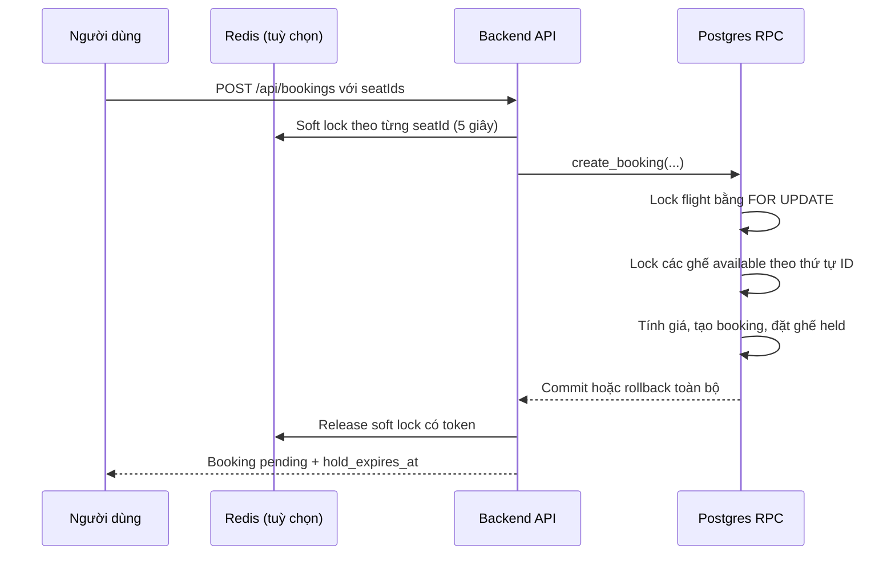
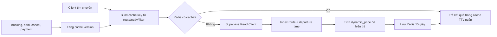
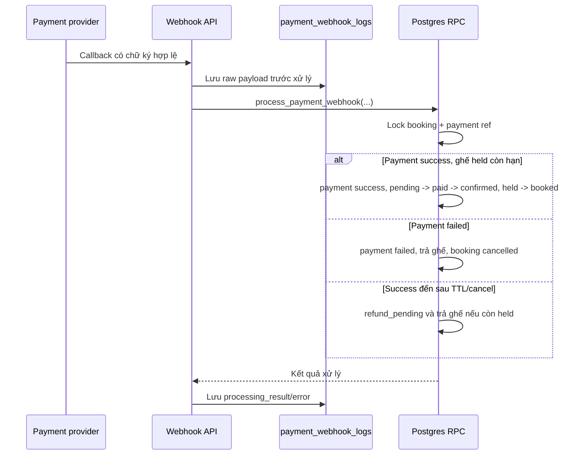

# Xử lý ba bài toán kinh điển của hệ thống đặt vé

Tài liệu này mô tả cách backend xử lý ba nhóm vấn đề thường gặp của một hệ thống đặt vé máy bay:

1. Tồn kho ghế và cạnh tranh đồng thời.
2. Tìm kiếm chuyến bay và cache.
3. Thanh toán phân tán, callback đến muộn và bù trừ giao dịch.

Thiết kế phù hợp với quy mô hiện tại: đơn giản để vận hành, nhưng đặt tính đúng đắn ở database để có thể scale dần. Migration bắt buộc cho các phần bên dưới là:

```text
supabase/migrations/20260715230000_harden_inventory_search_and_saga.sql
```

## Nguyên tắc chung

- Postgres là nguồn sự thật cho ghế, booking, giá chốt và trạng thái thanh toán.
- Redis chỉ dùng để tăng tốc hoặc giảm tranh chấp; Redis mất kết nối không được làm phát sinh overbooking.
- Client không tự quyết định giá, trạng thái ghế hay thanh toán.
- Mỗi thay đổi quan trọng đều đi qua RPC Postgres để nhiều câu lệnh chạy trong cùng một database transaction.
- Tất cả hàm liên quan trong code đều có comment `Bài toán 1`, `Bài toán 2` hoặc `Bài toán 3` ở ngay phía trước.

---

## 1. Quản lý tồn kho ghế và chống bán trùng

### Vấn đề

Hai khách có thể cùng nhìn thấy ghế `16A` đang trống và cùng bấm đặt. Nếu backend chỉ kiểm tra ghế bằng JavaScript rồi mới update, cả hai request có thể cùng đọc trạng thái `available` trước khi request nào kịp ghi `held`. Kết quả là bán trùng ghế.

### Cách xử lý



### Lớp bảo vệ 1: Redis soft lock

`withRedisLocks` lấy lock ngắn 5 giây cho từng `seatId` bằng Redis `SET key token NX PX 5000`.

- Mục tiêu: chặn double-click và giảm số request cùng tranh một ghế phải chờ ở database.
- Các key được sort trước khi lấy lock để giảm nguy cơ deadlock ở Redis.
- Khi release, script Lua kiểm tra token trước khi xóa. Một request cũ không thể xóa lock mà request mới vừa nhận.
- Nếu Redis chưa cấu hình hoặc đang lỗi, code chạy thẳng transaction Postgres. Vì vậy Redis không phải điểm quyết định quyền sở hữu ghế.

### Lớp bảo vệ 2: Transaction và row lock Postgres

Hàm `create_booking` trong Postgres mới là lớp chống overbooking thực sự.

1. Lock đúng một dòng `flights` bằng `FOR UPDATE`. Điều này đồng bộ số `available_seats` và việc tính giá động cho một chuyến bay.
2. Lock các ghế đã chọn có `status = 'available'` bằng `FOR UPDATE`, với `ORDER BY id` cố định.
3. Kiểm tra số ghế lock được phải đúng bằng số ghế client gửi. Nếu thiếu một ghế, RPC ném lỗi `P0001` và toàn bộ transaction rollback.
4. Tạo `bookings` với `status = 'pending'` và `hold_expires_at = NOW() + 10 minutes`.
5. Chuyển ghế sang `held`, liên kết `booking_id`, giảm `flights.available_seats`, tạo passenger/dịch vụ đi kèm và snapshot giá.
6. Chỉ khi mọi bước thành công Postgres mới commit. Nếu bất kỳ bước nào lỗi, không có booking nửa vời hoặc ghế bị trừ sai.

### TTL giữ ghế và giải phóng ghế

Ghế `held` không được giữ vĩnh viễn. Có hai đường giải phóng:

- Job backend chạy mỗi 60 giây gọi RPC `release_expired_held_seats`.
- Khi có request booking mới cho cùng chuyến bay, `create_booking` cũng tự dọn các ghế held đã quá hạn của chuyến đó trước khi chọn ghế mới.

`release_expired_held_seats` dùng `FOR UPDATE SKIP LOCKED`, vì thế nhiều instance backend cùng chạy job vẫn không xử lý cùng một ghế. Khi dọn, hàm trả ghế về `available`, cộng lại `available_seats` và hủy booking `pending` tương ứng.

### State machine ghế

```text
available -> held -> booked
              |
              +-> available (người dùng hủy, payment fail, hoặc TTL hết hạn)
```

Không có luồng client nào được phép ghi trực tiếp sang `booked`; chỉ webhook thanh toán thành công mới xác nhận `held -> booked`.

### Files liên quan

| File | Trách nhiệm |
| --- | --- |
| `backend/src/config/cache.js` | Redis client, soft lock token, release lock an toàn. |
| `backend/src/modules/bookings/booking.service.js` | Dùng Redis soft lock trước khi gọi RPC tạo booking. |
| `backend/src/modules/bookings/booking.queries.js` | Gọi RPC `create_booking` và `cancel_booking`. |
| `backend/src/modules/seats/seat.service.js` | Giữ/trả một ghế qua RPC và vô hiệu cache sau commit. |
| `backend/src/modules/seats/seat.queries.js` | Gọi RPC `hold_seat`, `release_held_seat`, lấy dữ liệu sơ đồ ghế. |
| `backend/src/jobs/seatHoldCleanup.job.js` | Job dọn ghế hết hạn mỗi phút. |
| `supabase/migrations/20260715230000_harden_inventory_search_and_saga.sql` | Cột `hold_expires_at`, index held seat, các RPC lock/TTL. |
| `frontend/src/components/booking/SeatMap.jsx` | Hiển thị ghế theo hàng và lối đi. |
| `frontend/src/features/seats/SeatSelector.jsx` | Poll trạng thái ghế mỗi 15 giây, tạo booking để giữ ghế. |
| `backend/database/seed-realistic-flights.mjs` | Tự bổ sung sơ đồ ghế cho các chuyến bay chưa có dữ liệu ghế. |

---

## 2. Tìm kiếm chuyến bay, cache và giá động

### Vấn đề

Tìm kiếm chuyến bay là endpoint public, bị gọi nhiều nhất. Nếu mọi request đều JOIN chuyến bay, hãng bay, sân bay, tàu bay và đếm chính xác toàn bộ kết quả thì database dễ bị quá tải. Ngoài ra giá hiển thị phải phản ánh tình trạng lấp đầy ghế nhưng không được làm giá lúc thanh toán bị sai.

### Cách xử lý



### Cache versioning thay vì xóa theo prefix

Cache key có dạng:

```text
flight-search:<version>:<base64-filter>
```

Khi ghế thay đổi do giữ ghế, hủy booking, webhook thanh toán hoặc admin sửa chuyến bay, backend gọi `bumpCacheVersion('flight-search')`.

Cache key mới lập tức khác key cũ nên cache cũ tự hết hạn sau TTL; không cần dùng Redis `SCAN` để tìm/xóa hàng loạt key. Đây là cách invalidation O(1), đơn giản và an toàn hơn ở quy mô hiện tại.

### Read/write separation

`supabaseRead` được tạo từ các biến môi trường tùy chọn:

```text
SUPABASE_READ_URL=
SUPABASE_READ_SERVICE_ROLE_KEY=
```

Nếu không có hai biến này, read client tự fallback về Supabase chính. Khi hạ tầng có read replica, chỉ cần cấu hình hai biến trên; code tìm kiếm không cần đổi API.

Các thao tác ghi như tạo booking, update flight, webhook payment vẫn luôn dùng `supabase` write client.

### Index và truy vấn

Migration tạo index partial cho luồng tìm kiếm phổ biến:

```sql
CREATE INDEX idx_flights_search_route_departure
  ON flights(origin_airport_id, destination_airport_id, departure_time)
  WHERE status IN ('scheduled', 'boarding', 'delayed');
```

Query chỉ select các cột cần cho màn hình, phân trang bằng `.range()`, sắp xếp theo `departure_time`, và dùng `count: 'planned'` thay vì `exact` để không phải đếm toàn bảng trong mọi request.

### Giá động nhưng vẫn chốt giá an toàn

`dynamic_price` trên API search/detail là giá **hiển thị**. Hệ số theo tỷ lệ ghế còn:

| Ghế còn / tổng ghế | Hệ số |
| --- | ---: |
| Trên 50% | 1.00 |
| 25%–50% | 1.10 |
| 10%–25% | 1.20 |
| Từ 10% trở xuống | 1.35 |

Khi người dùng đặt vé, cùng công thức được chạy lại trong `create_booking` sau khi flight và seat đã bị lock. `bookings.price_snapshot` lưu giá chốt tại thời điểm đó. Vì vậy cache hay giá hiển thị cũ không thể làm client thanh toán sai giá.

Ở quy mô hiện tại không cần Elasticsearch/Meilisearch: dữ liệu là route + ngày, Postgres index và Redis cache đáp ứng tốt. Khi cần tìm kiếm full-text, autocomplete lớn hoặc phân tích nhiều tiêu chí, chỉ cần thay phần query trong `flight.queries.js` bằng search adapter mà không thay luồng booking.

### Files liên quan

| File | Trách nhiệm |
| --- | --- |
| `backend/src/config/cache.js` | Kết nối Redis, JSON cache, cache version. |
| `backend/src/config/env.js` | Biến Redis, TTL cache và cấu hình read client. |
| `backend/src/config/supabase.js` | `supabase` write client và `supabaseRead` read client. |
| `backend/src/modules/flights/flight.queries.js` | Query search dùng read client, index-friendly filter và pagination. |
| `backend/src/modules/flights/flight.service.js` | Cache key, dynamic price, cache hit/miss và invalidation khi admin đổi flight. |
| `backend/src/modules/bookings/booking.service.js` | Bump cache version sau khi giữ/hủy chỗ. |
| `backend/src/modules/payments/payment.service.js` | Bump cache version sau khi payment xác nhận hoặc giải phóng ghế. |
| `supabase/migrations/20260715230000_harden_inventory_search_and_saga.sql` | Search index và hàm `calculate_dynamic_price_multiplier`. |
| `frontend/src/features/flights/flightView.js` | Ưu tiên `dynamic_price` để hiển thị giá. |

---

## 3. Giao dịch phân tán và Saga thanh toán

### Vấn đề

Thanh toán đi qua provider bên ngoài. Không thể có một transaction ACID duy nhất bao phủ cả database và VNPay/MoMo/Stripe. Một số tình huống cần xử lý:

- Ghế đã giữ nhưng khách không thanh toán trước TTL.
- Provider trừ tiền thành công nhưng webhook đến muộn, sau khi ghế đã hết hạn.
- Provider retry cùng webhook nhiều lần.
- Backend lỗi trong lúc xử lý callback.

### State machine

```text
Booking
pending -> paid -> confirmed
pending -> cancelled                  (payment failed / TTL hết hạn)
cancelled -> refund_pending           (payment success đến muộn)

Payment
pending -> success
pending -> failed
pending/success -> refund_pending     (cần tác vụ hoàn tiền bù trừ)
refund_pending -> refunded            (sau khi provider xác nhận hoàn tiền)
```

### Luồng webhook idempotent



### Write-ahead log cho webhook

Trước khi gọi RPC, `payment.service.js` insert raw callback vào `payment_webhook_logs`.

- Nếu RPC/database lỗi, vẫn còn payload, transaction reference, provider và error để retry hoặc đối soát thủ công.
- Sau khi RPC trả về, log được cập nhật `processing_result` hoặc `error_message`.
- Bảng log không cho client truy cập qua RLS; chỉ backend service-role dùng.

### Idempotency

`process_payment_webhook` lock payment bằng `transaction_ref`.

- Nếu transaction reference đã có trạng thái cuối (`success`, `failed`, `refund_pending`, `refunded`), RPC trả kết quả cũ với `processed: false`.
- Callback retry từ provider không thể confirm ghế hoặc cộng/trừ tồn kho lần hai.
- Nếu transaction reference thuộc booking khác, RPC từ chối ngay.

### Compensation / Saga

Với callback `success` đến sau TTL:

1. Không xác nhận booking, vì ghế không còn hợp lệ.
2. Nếu ghế vẫn `held`, RPC trả ghế về inventory ngay.
3. Payment và booking chuyển sang `refund_pending`.
4. Backend tạo notification `general` báo cần review hoàn tiền.
5. Worker hoặc nhân viên tích hợp API refund thật của provider, rồi mới chuyển payment sang `refunded`.

Phần refund thật không được giả lập trong backend, vì cần API/secret riêng của từng cổng thanh toán. Nhưng dữ liệu và state đã sẵn sàng để retry an toàn, không hoàn tiền hai lần.

### Files liên quan

| File | Trách nhiệm |
| --- | --- |
| `backend/src/modules/payments/payment.webhook.js` | Kiểm tra HMAC signature của webhook trước khi xử lý. |
| `backend/src/modules/payments/payment.service.js` | Write-ahead log, điều phối webhook, notification, invalidation cache. |
| `backend/src/modules/payments/payment.queries.js` | Ghi/cập nhật `payment_webhook_logs`, gọi RPC payment. |
| `backend/src/modules/payments/payment.schema.js` | Validate payload callback và provider hợp lệ. |
| `backend/src/modules/bookings/booking.queries.js` | Lấy booking cùng `hold_expires_at` để chặn tạo payment intent quá hạn. |
| `backend/src/modules/payments/payment.service.js` | Từ chối tạo payment intent nếu TTL đã hết. |
| `supabase/migrations/20260715230000_harden_inventory_search_and_saga.sql` | `payment_webhook_logs`, payment status `refund_pending`, RPC `process_payment_webhook`. |

---

## Cấu hình cần có

```env
# Redis là tùy chọn. Không có Redis, transaction Postgres vẫn chống overbooking.
REDIS_URL=redis://localhost:6379
FLIGHT_SEARCH_CACHE_TTL_SECONDS=15
SEAT_CLEANUP_INTERVAL_MS=60000

# Tùy chọn khi hạ tầng có read replica.
SUPABASE_READ_URL=
SUPABASE_READ_SERVICE_ROLE_KEY=
```

Không được đưa `SUPABASE_SERVICE_ROLE_KEY`, `SUPABASE_READ_SERVICE_ROLE_KEY` hoặc `PAYMENT_WEBHOOK_SECRET` vào frontend.

## Checklist vận hành

1. Chạy migration `20260715230000_harden_inventory_search_and_saga.sql` trước khi restart backend.
2. Đảm bảo backend chạy liên tục để job dọn TTL hoạt động; ở production nên có scheduled job/Edge Function dự phòng.
3. Cấu hình `REDIS_URL` nếu muốn bật cache và soft lock.
4. Theo dõi `payment_webhook_logs` có `error_message` hoặc `refund_pending` để xử lý đối soát.
5. Khi thêm provider thật, chỉ tin webhook server-to-server đã xác minh chữ ký; không tin kết quả trả về từ frontend.
